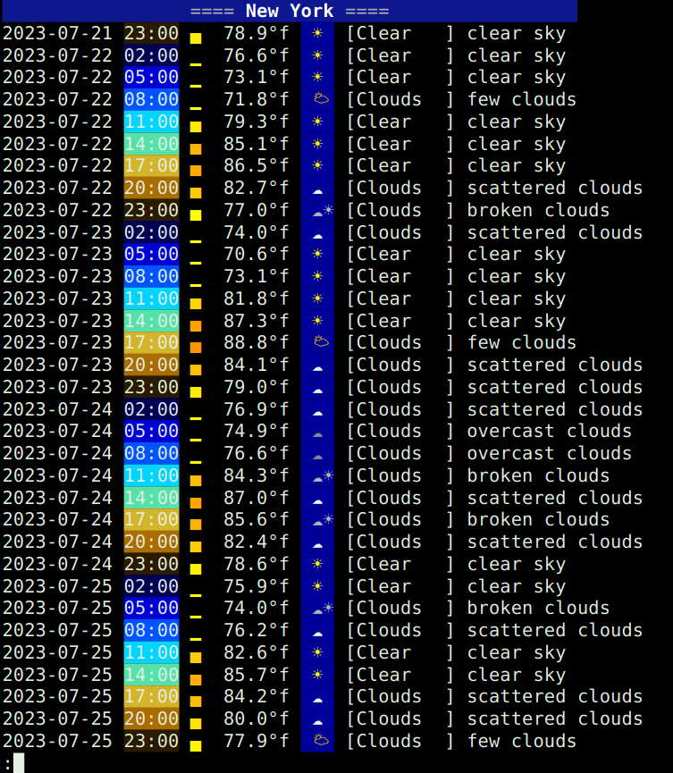

## Weather shell utils

## Installation
1. Clone me!
1. Symlink `forecast` into your favorite bin/ path
1. Copy `owm.env-example--copy-to--owm.env` to `owm.env`. Edit it to set your config dir, or leave it alone.
1. Set your OpenWeatherMap API key
    1. After you create an account, get your key at [https://home.openweathermap.org/api\_keys](https://home.openweathermap.org/api_keys)
    1. In `owm.env`, the location of `openweathermap-api-key.txt` is specified. By default it needs to go in  in `~/.config/owm/openweathermap-api-key.txt`
    1. Place your key in that file. Nothing else, just the API key (with or without a newline afterwards should be fine)

## Usage
1. **Set default (local) coordinates**: `forecast -l "some city, some state"`: Does an openstreetmap search to obtain coordinates. With -l it stores this as your default.
1. **Run default**: `forecast`: Gets weather for default (local) coordinates.
1. **Run specific location**: `forecast "some city, some state"`: Gets weather for chosen city. Uses openstreetmap to find coords.

## Known issues
* Outputs a bunch of junk to stderr before the weather forecast
* Other than that it's perfect!
